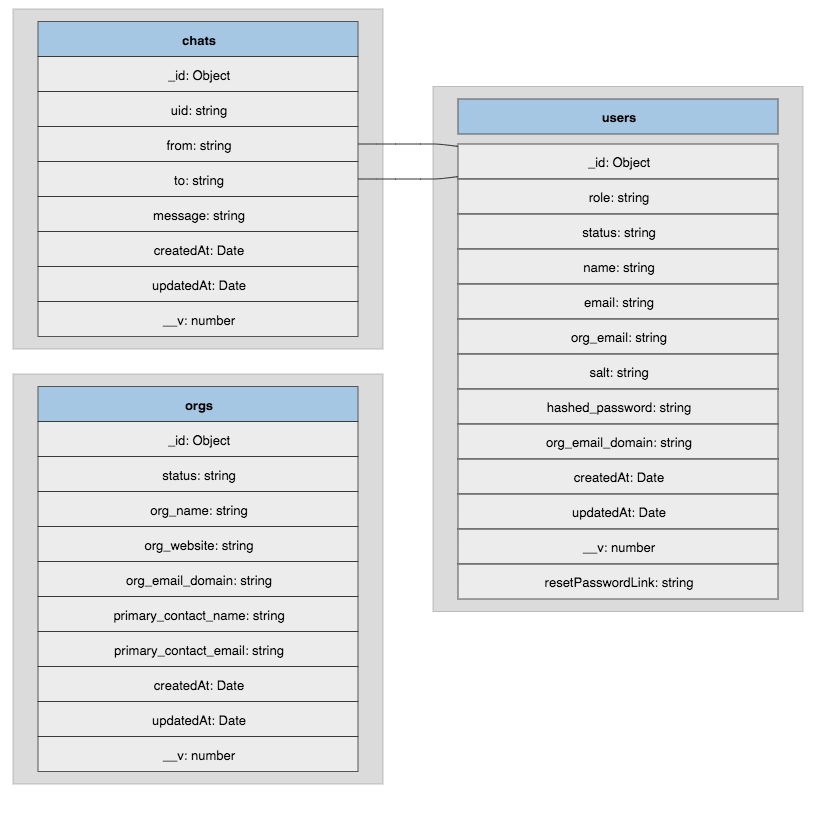

A README.md document that contains any assumptions and core design considerations that will
position the assignment submission. Feel free to add suggestions on how the system could be
improved in subsequent releases.

## Organisation Chat App

### Demo

https://www.youtube.com/embed/YSR7g-7O_fg

### Features

[x] UI: Built using tailwind
[x] UI: Organisation Sign Up
[x] UI: User Sign Up/ Sign In using Google OAuth
[x] UI: User Sign Up and Sign In Form
[x] UI: Activate user
[x] UI: User edit profile
[x] UI: Forgot password
[x] UI: Reset password
[x] UI: One to one chat interface for user with inn organisation
[x] Mail: integration with sendgrid
[x] Mail: Sent on Organisation up
[x] Mail: Sent on User Sign up
[x] Mail: Sent on Forgot password

### Routes

| Method | Path                           | Description                             |
| :----- | :----------------------------- | :-------------------------------------- |
| `GET`  | `/api/ping`                    | Health check                            |
| `POST` | `/api/signup`                  | Sign Up user                            |
| `POST` | `/api/signin`                  | Sign In user                            |
| `POST` | `/api/google-login`            | Sign Up using Google login              |
| `POST` | `/api/account-activation`      | Activate account using token            |
| `PUT`  | `/api/forgot-password`         | Forgot password                         |
| `PUT`  | `/api/reset-password`          | Reset password                          |
| `GET`  | `/api/user/:id`                | Get user details                        |
| `PUT`  | `/api/user/update`             | Update user details                     |
| `PUT`  | `/api/admin/update`            | Update user                             |
| `POST` | `/api/org/signup`              | Sign Up as organnisation                |
| `POST` | `/api/org/account-activation`  | Activate organisation using tokenn      |
| `GET`  | `/api/org/user/all`            | Get all users of organisation           |
| `PUT`  | `/api/org/user/status/:id`     | Change status of user                   |
| `PUT`  | `/api/org/user/role/:id`       | Change role of user                     |
| `PUT`  | `/api/org/user/remove/:id`     | Remove user from organisation           |
| `GET`  | `/api/org/user/chat/:id1/:id2` | Admin can access chat between two users |

### Improvements

[ ] User status: send online/offline status of user
[ ] Chat typing indicatiors: send indication when user starts typing
[ ] Add support to create room and allow group chat
[ ] Move chat server as separate service
[ ] Remove user data on being removed from organisation
[ ] Remove user and their data on removing organisation
[ ] Dockerize app to run frontend and backend in containers

### UI Flow

### DB Schema

### Assumptions

[ ] User can signup and signin without Google login

[ ] Having Google login should not be mandatory as Organisation admin and Users might not have Google account
